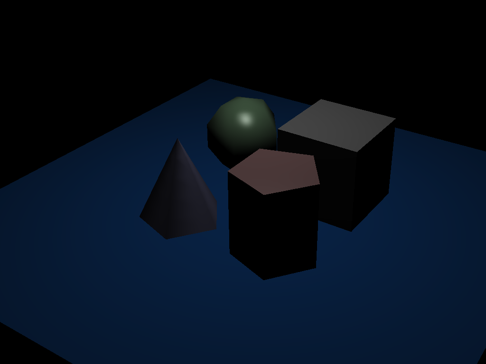
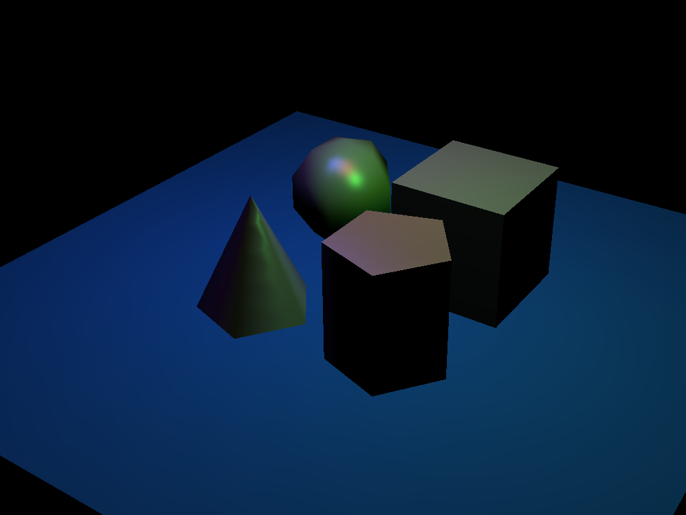
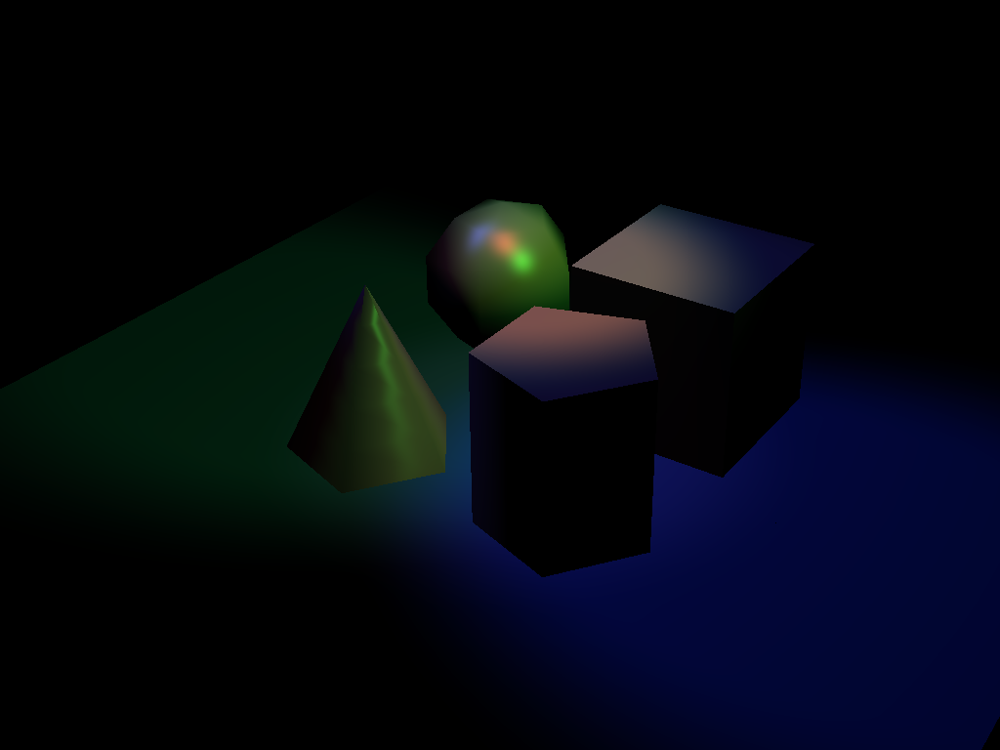
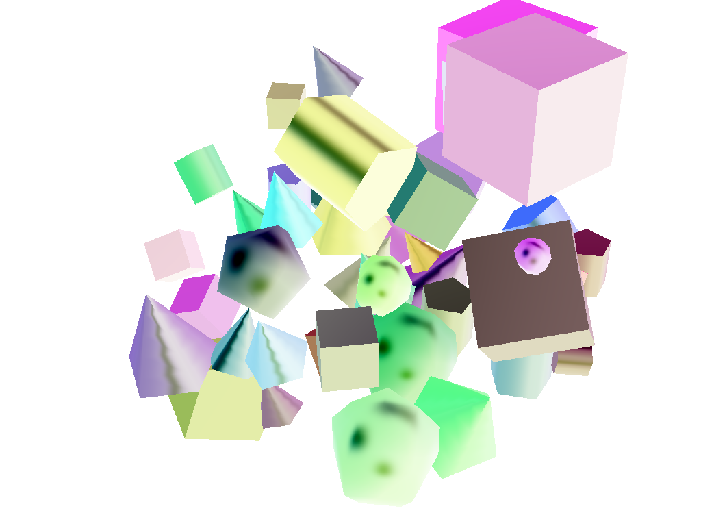
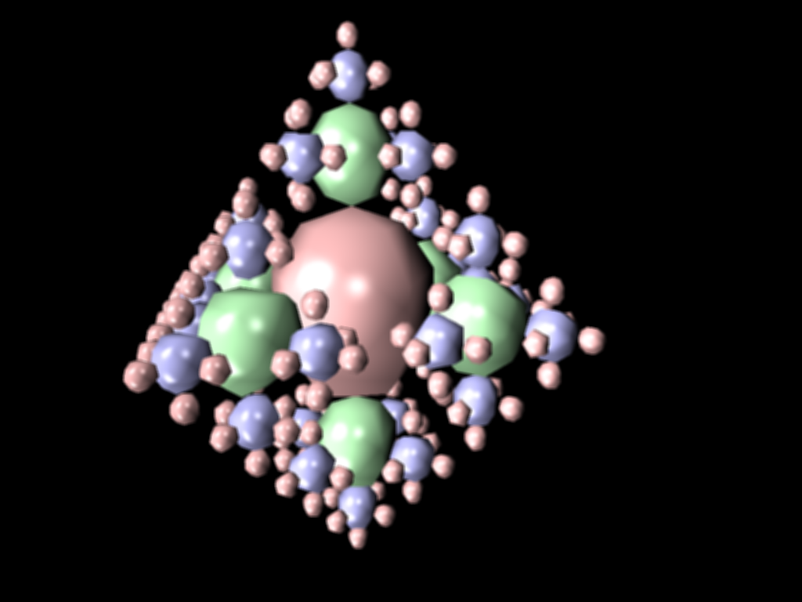

## Project 6: Action!

Please fill this out for Action! only. The project handout can be found [here](https://cs1230.graphics/projects/realtime/2).

### Output Comparison

> [!IMPORTANT]
> Before generating expected outputs, make sure to:
>
> 1. Set your working directory to the project directory
> 2. From the project directory, run `git submodule update --recursive --remote` to update the `scenefiles` submodule.
> 3. Change all instances of `"lights-camera"` in `mainwindow.cpp` to `"action"` (there should be 2 instances, one in `MainWindow::onUploadFile` and one in `MainWindow::onSaveImage`).

Run the program, open the specified `.json` file and follow the instructions to set the parameters.

If the output you are generating is an image, save the image with the specified file name using the "Save image" button in the UI. Be sure to follow the instructions in the left column to set the file name. Once you save the images, they will appear in the table below.

If the output you are generating is a video, reference the [Screen Recording Guide](https://cs1230.graphics/docs/screen-recording) to capture a video of the specified interaction. Once you've recorded everything, navigate to this template file in Github, click edit, and either select or drag-and-drop each of your videos into the correct location. This will upload them to GitHub (but not include them in the repo) and automatically embed them into this Markdown file by providing a link. Make sure to double-check that they all show up properly in the preview.

We're **not** looking for your video to **exactly** match the expected output (i.e. draw the exact same shape). Just make sure to follow the instructions and verify that the recording fully demonstrates the functionality of that part of your project.

> [!NOTE]
> There may be issues with the image saving functionality, and the images may not save the exact same way as the expected outputs. This is acceptable, as long as your output demonstrates correct functionality.

#### Point and Spot Lights

|                                File/Method To Produce Output                                 |                                                Expected Output                                                 |                                                       Your Output                                                       |
| :------------------------------------------------------------------------------------------: | :------------------------------------------------------------------------------------------------------------: | :---------------------------------------------------------------------------------------------------------------------: |
| Input: `point_light_1.json` Output: `point_light_1.png` Parameters: (5, 5, 0.1, 100) |  |  |
| Input: `point_light_2.json` Output: `point_light_2.png` Parameters: (5, 5, 0.1, 100) |  |  |
| Input: `spot_light_1.json` Output: `spot_light_1.png`  Parameters: (5, 5, 0.1, 100)  |   |    |
|  Input: `spot_light_2.json` Output: `spot_light_2.png` Parameters: (5, 5, 0.1, 100)  |   |    |

#### Invert

> [!NOTE]
> If you did not implement the invert filter, you can skip this section.

|                                                      File/Method To Produce Output                                                      |                                                      Expected Output                                                      |                                                                  Your Output                                                                  |
| :-------------------------------------------------------------------------------------------------------------------------------------: | :-----------------------------------------------------------------------------------------------------------------------: | :-------------------------------------------------------------------------------------------------------------------------------------------: |
| Input: `primitive_salad_1.json` **Apply invert filter** Output: `primitive_salad_1_invert.png` Parameters: (5, 5, 0.1, 100) |  |  |

#### Grayscale

> [!NOTE]
> If you did not implement the grayscale filter, you can skip this section.

|                                                         File/Method To Produce Output                                                         |                                                       Expected Output                                                        |                                                                     Your Output                                                                     |
| :-------------------------------------------------------------------------------------------------------------------------------------------: | :--------------------------------------------------------------------------------------------------------------------------: | :-------------------------------------------------------------------------------------------------------------------------------------------------: |
| Input: `primitive_salad_1.json` **Apply grayscale filter** Output: `primitive_salad_1_grayscale.png` Parameters: (5, 5, 0.1, 100) |  |  |

> [!WARNING]
> Kernel-based filters might not work the same on different devices. This is explained in more detail in the project handout. If your output doesn't seem to quite match our output but you think your implementation is correct, be sure to let your mentor know.

#### Sharpen

> [!NOTE]
> If you did not implement the sharpen filter, you can skip this section.

|                                                        File/Method To Produce Output                                                        |                                                       Expected Output                                                       |                                                                    Your Output                                                                    |
| :-----------------------------------------------------------------------------------------------------------------------------------------: | :-------------------------------------------------------------------------------------------------------------------------: | :-----------------------------------------------------------------------------------------------------------------------------------------------: |
| Input: `recursive_sphere_4.json` **Apply sharpen filter** Output: `recursive_sphere_4_sharpen.png` Parameters: (5, 5, 0.1, 100) |  |  |

#### Blur

> [!NOTE]
> If you did not implement the blur filter, you can skip this section.

|                                                     File/Method To Produce Output                                                     |                                                     Expected Output                                                      |                                                                 Your Output                                                                 |
| :-----------------------------------------------------------------------------------------------------------------------------------: | :----------------------------------------------------------------------------------------------------------------------: | :-----------------------------------------------------------------------------------------------------------------------------------------: |
| Input: `recursive_sphere_4.json` **Apply blur filter** Output: `recursive_sphere_4_blur.png` Parameters: (5, 5, 0.1, 100) |  |  |

#### Camera Translation

_Instructions:_ Load `chess.json`. For about 1 second each in this order, press:

- <kbd>W</kbd>, <kbd>A</kbd>, <kbd>S</kbd>, <kbd>D</kbd> to move in each direction by itself
- <kbd>W+A</kbd> to move diagonally forward and to the left
- <kbd>S+D</kbd> to move diagonally backward and to the right
- <kbd>Space</kbd> to move up
- <kbd>Cmd/Ctrl</kbd> to move down

##### Expected Output

https://github.com/BrownCSCI1230/projects_realtime_template/assets/45575415/710ff8b4-6db4-445b-811d-f6c838741e67

##### Your Output

<!---
Paste your output on top of this comment!
-->

https://github.com/BrownCSCI1230/projects-realtime-bnugent97/assets/123997718/2dd6d8a2-6204-4ad9-8c20-0ce84c10f804

#### Camera Rotation

_Instructions:_ Load `chess.json`. Take a look around!

##### Expected Output

https://github.com/BrownCSCI1230/projects_realtime_template/assets/45575415/a14f4d32-88ee-4f5f-9843-74dd5c89b9dd

##### Your Output

<!---
Paste your output on top 

of this comment!
-->

https://github.com/BrownCSCI1230/projects-realtime-bnugent97/assets/123997718/457f031a-90c0-4bd8-8975-ece5a8533f95

### Design Choices

#### Lights
My implementation of lights was fairly straightforward using a combintion of the code I had already written for directional lights, and how I carried out lighting for Point and Spotlights in the raytracing project. No real significant design choices of note, the primary location for the implementaion was within the shader files. 

#### Camera Movement
Implementing camera movement was also fairly straight forward. I essentially just update the camera position within the EventTimer function for each respective key. 

#### FBOS
Finally, implementing the fliters using FBOs was straightforward as well with an implementation directly inspired by Lab 11. Nothing really novel of note within my design choices, really just ported over and refactored my code to accomodate the functionlity from lab.

### Collaboration/References
I referenced and used code generated from ChatGPT across all segments of this project. In particular, I used its guidance in working through how to apply the key pressed to camera movement, and used it to help debug an FBO issue I had. 

### Known Bugs

No known bugs. 🤞

### Extra Credit

#### Additional Per-Pixel Filter

For my additional per-pixel filter I implemented a blue-tint filter. Please find examples of it below, and it can be applied by selecting the Extra Credit 1 box.

#### Additional Kernel Based Filter

For my additional Kernel based filter I implemented a two pass Sobel edge detector filter. This filter detects both horizontal and vertical edges. Please find examples of it in action below. It can be applied by selecting the extra credit 2 box.

#### FXAA Anti-Aliasing

Finally the bulkiest implemention for extra credit was my FXAA anti-aliasing shader. I created a new shader altogether to implement FXAA, and this shader operates by calulating the luminance of the center pixel and its neighbors. Luminance is used for edge detection, which determines where to apply the anti-aliasing effect. When an edge is detected, the shader averages the color of the center pixel with its neighbors. Please see an example of my code implementation below: 

Frankly, with the example scenes provided to us it is a bit difficult to see it in action, however I think the chess board is the best example of FXAA in action. Please some examples below. 

##### Pre-FXAA

###### Post-FXAA

